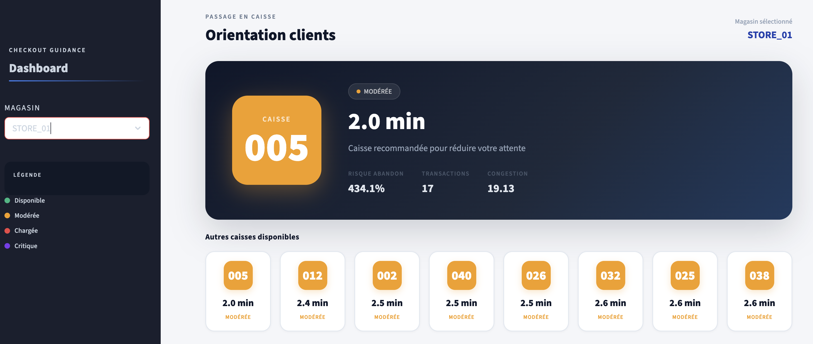
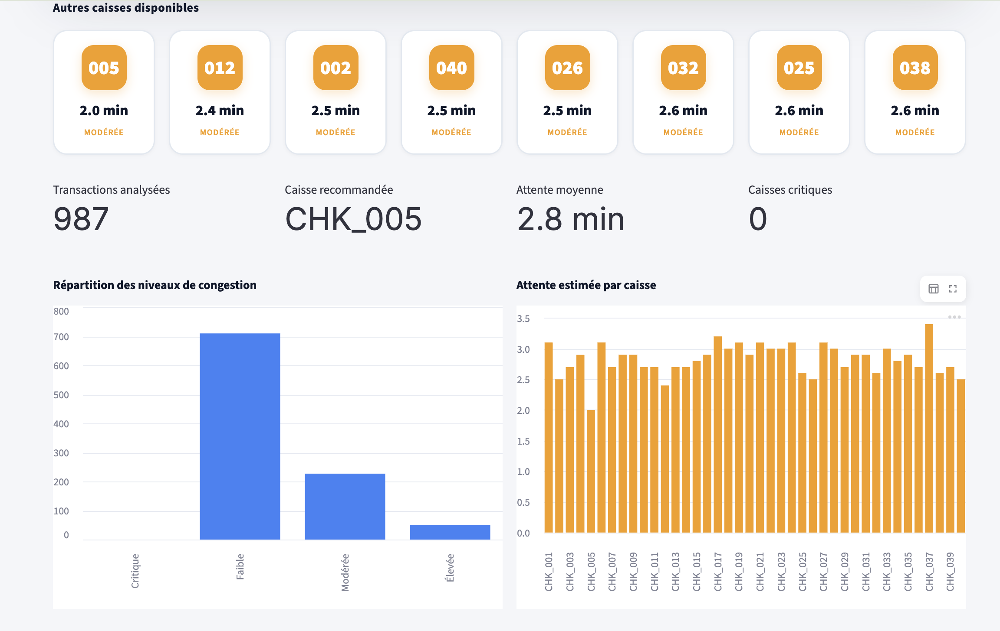
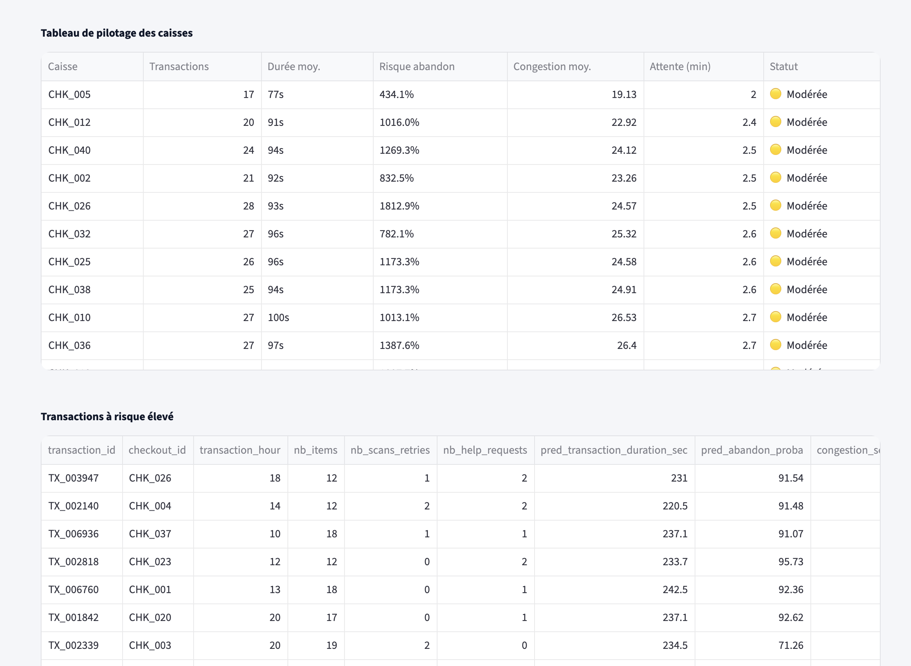

# 🛒 Smart Checkout Prediction System

## 🚀 Overview

This project demonstrates an **AI-powered decision system for retail checkout optimization**.

The goal is not only to analyze transactions, but to **anticipate congestion, reduce waiting time, and guide customers in real time**.

It simulates a real-world operational environment where:
- customers need fast guidance
- stores need to manage flow efficiently
- systems must translate data into **simple decisions**

---

## 🎯 Product Vision

Traditional dashboards show data.

👉 This system delivers **decisions**:

- Which checkout should customers go to?
- What is the expected waiting time?
- Which areas are under operational pressure?
- Where should staff intervene?

This project illustrates a **product mindset**, not just a data model.

---

## 🧠 Core Features

### 1. Predictive Models

- ⏱️ **Transaction duration prediction** (Regression)
- ⚠️ **Abandonment risk prediction** (Classification)
- 📊 **Congestion scoring system**

Built using:
- Random Forest models
- Behavioral features (items, retries, help requests, time)

---

### 2. Real-Time Checkout Guidance

The system identifies:

- ✅ Best checkout available
- ⏳ Estimated waiting time
- 📍 Alternative recommended checkouts

👉 Output is simplified for **customer-facing display**

---

### 3. Operational Decision Layer

Each checkout is evaluated based on:

- predicted duration
- congestion score
- abandon risk

This enables:

- staff allocation
- queue management
- friction detection

---

## 🖥️ Product Interface

### 🎯 Customer Guidance Screen



👉 Large, simple, actionable:
- recommended checkout
- waiting time
- visual priority

---

### 🧭 Alternative Checkout Suggestions



👉 Helps distribute customer flow across multiple checkouts

---

### 📊 Operational Dashboard



👉 Used by store teams:
- congestion distribution
- checkout performance
- risky transactions

---

## ⚙️ Architecture
Data → Features → ML Models → Scoring → UI

### Stack:
- Python
- Pandas / NumPy
- Scikit-learn
- Streamlit

---

## 📊 Results (Simulated)

- Accurate transaction duration estimation
- High detection of friction patterns
- Realistic congestion modeling
- Actionable outputs (not just predictions)

---

## 🏪 Use Cases

- Retail self-checkout systems
- Store operations optimization
- Queue management
- Customer experience improvement

---

## 💡 Key Product Insight

This project demonstrates the shift from:

❌ Data dashboards  
➡️  
✅ Decision systems

---

## 🧠 Why this project matters (Product Perspective)

As a Product Manager, the challenge is not building models.

👉 It is turning complexity into **simple user decisions**.

This project shows:

- strong product thinking
- ability to connect AI → business → UX
- operational impact mindset
- system design beyond pure analytics

---

## 🚀 How to run

```bash
python main.py
streamlit run app/streamlit_app.py